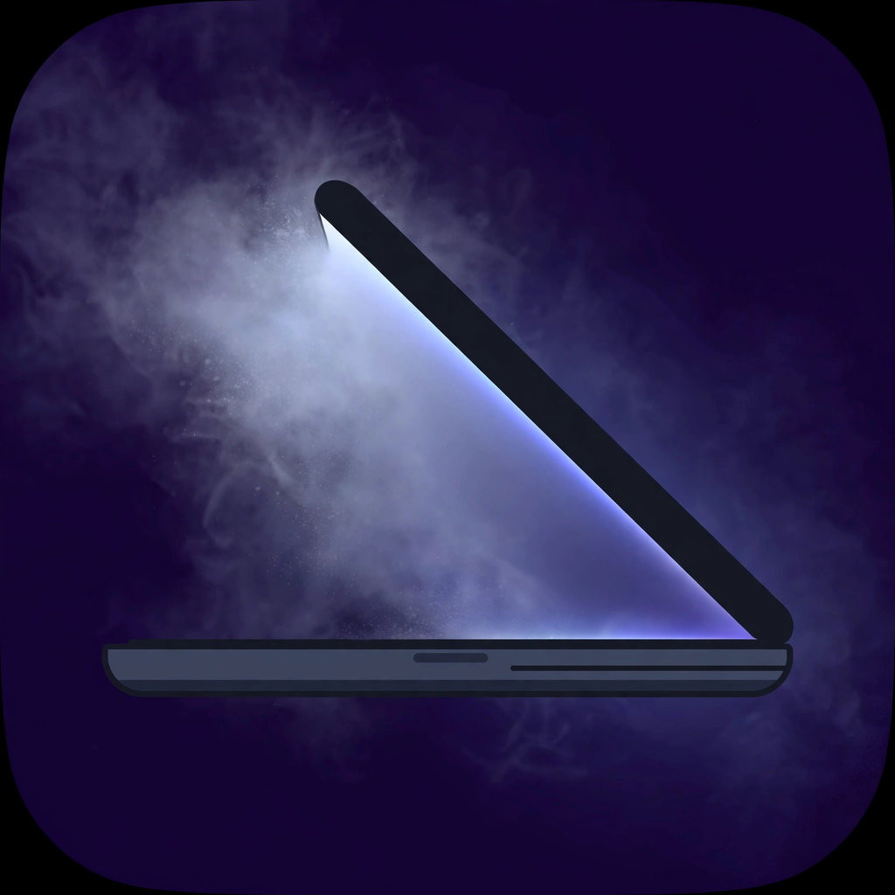
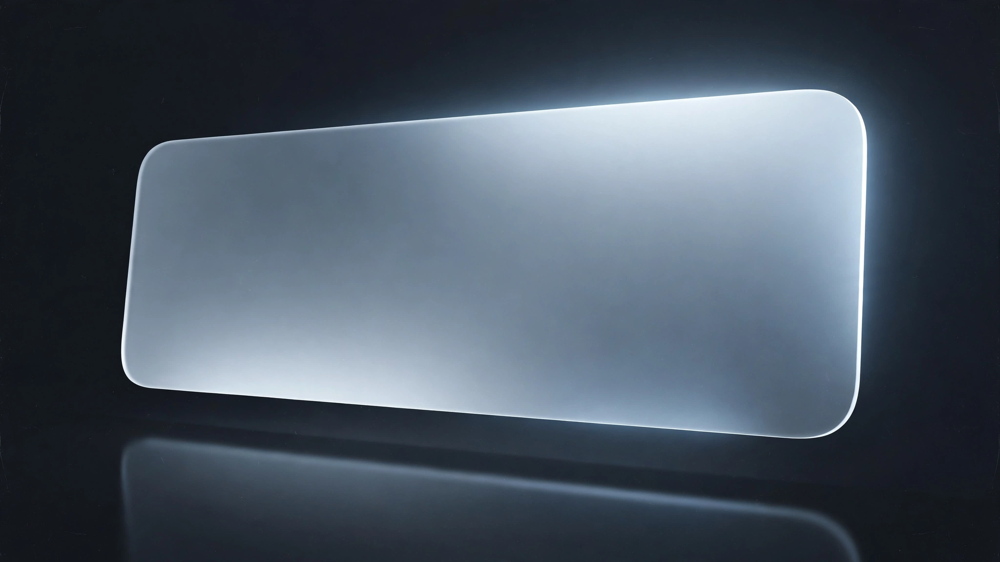
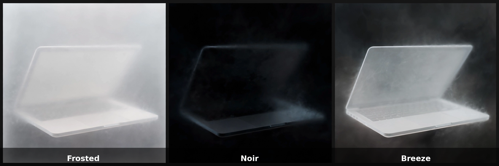

<div align="center">



# Tilt

**Depth for your lid.**

Close the lid and watch your screen lean away into frosted glass — tilt, blur, and fade, rendered live on the GPU. Pick a look, tune it, and forget it's there.



</div>

---

## Looks



One tap, three moods. Every look is just a bundle of the sliders underneath — fine-tune freely, and the card unselects when you wander off-preset.

- **Frosted** — milky glass, the classic look.
- **Noir** — deep blur that falls to black.
- **Breeze** — a whisper of depth, barely there.

## Features

- **Metal rendering** — perspective, blur, and dimming computed on the GPU as the lid closes. The shaders live as a real `.metal` file in the app's resources.
- **Live screen content** — ScreenCaptureKit keeps the picture under the effect updating in real time.
- **Lid-angle gauge** — the menu bar popover opens on an animated arc gauge of your live lid angle.
- **Animated looks** — picking a preset glides every slider (and the live effect) to the new look with an ease-out sweep. Grab a slider mid-flight and it yields to you.
- **Living frost** — a whisper of animated grain and a slow sheen drift through the glass. Frozen entirely when Reduce Motion is on.
- **Preview hotkey** — ⌥⌘T anywhere plays the effect once on your current screen, no lid required.
- **Launch at login** — set it once, it lives in the menu bar.
- **Intel-safe mipmaps** — if the MPS Gaussian pyramid can't encode on your GPU, the renderer falls back to blit mipmaps instead of black glass.

## Architecture

```
Sources/
  TiltSensor/     the lid-angle sensor (IOKit HID) — no UI, no Metal
  TiltApp/
    HingeController.swift   the brain: polling, prediction, state machine
    DepthStage.swift        the overlay window
    DepthRenderer.swift     the Metal renderer
    Capture.swift           one ScreenCaptureKit engine for stream + snapshots
    Geometry.swift          projection math, spring, blur gradient
    Shaders.metal           the effect, as real Metal (in Resources/)
    SettingsView.swift      the menu bar popover UI, incl. the lid gauge
    PreviewHotKey.swift     the global ⌥⌘T preview hotkey (Carbon)
  TiltProbe/      tilt-probe: a CLI for reading the raw sensor
```

## Install

**Dev builds** — every push to `main` publishes a DMG and a ZIP on the [dev prerelease](https://github.com/Sanjays2402/Tilt/releases/tag/dev). These are ad-hoc signed and not notarized, so on first launch right-click Tilt and choose Open.

Or **build it yourself** — it takes a minute.

Requires Xcode with Swift 6.0 or later. Run from the project directory:

```sh
./build.sh
```

The script creates `build/Tilt.app` with an ad-hoc signature. Open it from Finder, or build and launch with:

```sh
./build.sh --run
```

Grant **Screen Recording** permission when prompted — that's how the effect sees your screen. macOS may ask again after rebuilding with ad-hoc signing.

Requires macOS 14 or later and a MacBook with a compatible lid angle sensor. To check yours:

```sh
./build.sh && ./build/tilt-probe
```

## Code signing

The release workflow signs and notarizes automatically when these repository secrets are set:

- `APPLE_CERTIFICATE_P12_BASE64`
- `APPLE_CERTIFICATE_PASSWORD`
- `APPLE_TEAM_ID`
- `APPLE_NOTARY_KEY_P8_BASE64`
- `APPLE_NOTARY_KEY_ID`
- `APPLE_NOTARY_ISSUER_ID`

Without them, it ships ad-hoc-signed development builds.

## License

Licensed under the [Apache License 2.0](LICENSE).
